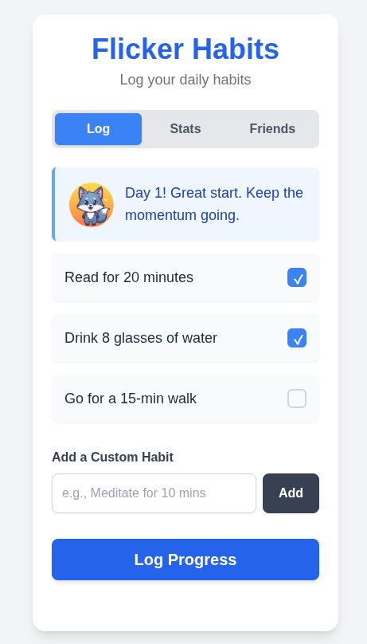
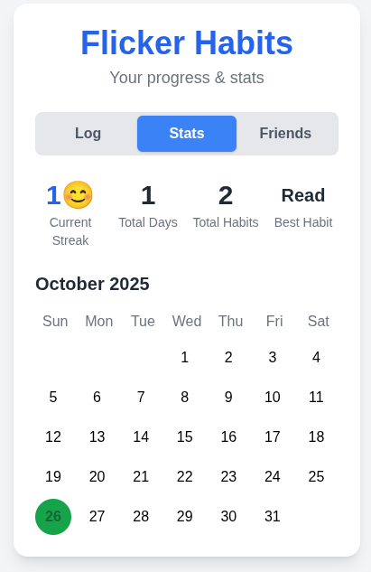
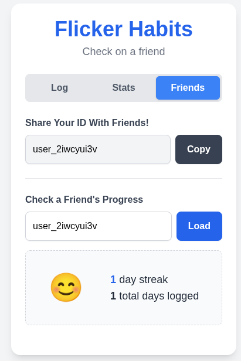
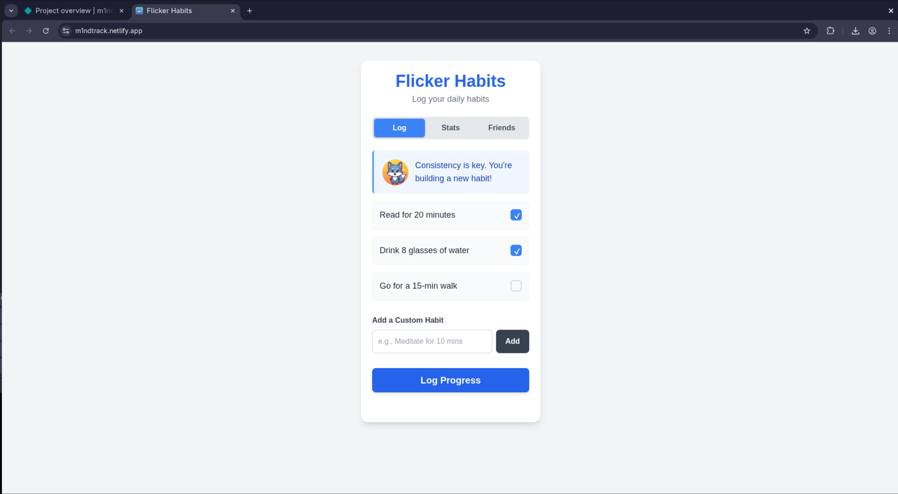

# ✨ Flicker Habits (MindTrack) - Hackathon Frontend

This is the frontend for the Flicker Habits wellness and habit tracking application, built for the Hackarena hackathon (Problem 3).

It's a simple, mobile-first web interface built with plain HTML, styled with Tailwind CSS, and powered by Vanilla JavaScript. It communicates with a separate Python/Flask backend API.

## Features 🎉

* **Daily Habit Logging:** Check off completed habits for the day.
* **Custom Habits:** Add and delete your own personalized habits.
* **Motivational Character:** Features "Flicker" the fox, whose image and accompanying quote change based on your current streak.
* **Stats Dashboard:** View your current streak, total logged days, total habits completed, and your most frequent ("best") habit.
* **Calendar View:** See your progress visually on a calendar, with logged days highlighted.
* **Friend Stat Viewer:** Share your anonymous User ID and view the public stats (streak, emoji, total days) of friends.
* **Persistent Data:** Uses `localStorage` to assign a unique anonymous ID to each user, ensuring data privacy. All habit and log data is fetched from the backend API.

## Tech Stack 🎨

* **Structure:** HTML5
* **Styling:** Tailwind CSS (via CDN)
* **Logic:** Vanilla JavaScript (ES6+)
* **Hosting:** Netlify

## How to Run Locally 💻

1.  **Clone the repository.**
2.  **Ensure Backend is Running:** You *must* have the [MindTrack Backend](https://github.com/CodeRulerNo1/mindtrack-backend) running locally (usually on `http://127.0.0.1:5000`).
3.  **Update Backend URL (if needed):** Open `index.html` and verify the `BACKEND_URL` constant points to your running backend (either `http://127.0.0.1:5000` for local or your live Render URL).
4.  **Open `index.html`:** Simply open the `index.html` file in your web browser.

## How to Deploy (for Hackathon) 🚀

This frontend is ready for deployment on **Netlify's free tier**.

1.  **Update Backend URL:** **CRITICAL:** Before deploying, open `index.html` and change the `BACKEND_URL` constant (around line 191) to point to your **live, deployed backend URL** on Render (e.g., `https://mindtrack-backend.onrender.com`).
2.  **Push to GitHub:** Push the updated `index.html` (and any image files in the `img` folder) to this public GitHub repository.
3.  **Deploy on Netlify:**
    * Connect your GitHub repository to Netlify.
    * Netlify will automatically detect it as a static site. No build command or publish directory is needed.
    * Deploy the site.

Your Flicker Habits app will be live!](https://coderulerno1.github.io/MindTrack-Frontend/)

